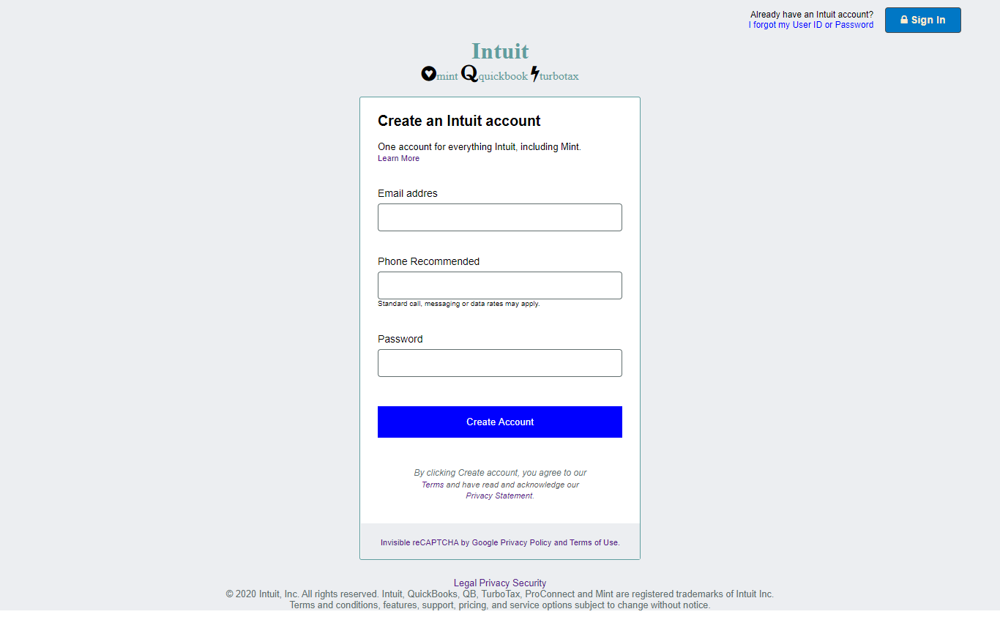

# HTML_FORM

> We created a form for the user can sign-in the intuit platform.

Additional description about the project and its features.

## Built With

- HTML,
- CSS,
- FONTAWESOME

## Live Demo

[Live Demo Link](https://jacobo12montes.github.io/HTML_Forms/)

## Getting Started

**This is an example of how you may give instructions on setting up your project locally.**
**Modify this file to match your project, remove sections that don't apply. For example: delete the testing section if the currect project doesn't require testing.**

To get a local copy up and running follow these simple example steps.

### Open a web browser

### Visit Repository

### Download Repository (https://biodunjohnson.github.io/youtube-frontpage/)

### Run index.html file (into folder html)

## Authors

👤 **James Friday Omage**

- Gmail: [@gmail](johnsonabiodun760@gmail.com)
- Github: [@githubhandle](https://github.com/biodunJohnson)
- Twitter: [@twitterhandle](https://twitter.com/JamesJo44083758)
- Linkedin: [linkedin](https://www.linkedin.com/in/friday-omage-299a04b4/)

👤 **Juan Jacobo Hincapie Montes**

- Gmail: [@gmail](jacobo12.montes@gmail.com)
- Github: [@githubhandle](https://github.com/jacobo12montes)
- Twitter: [@twitterhandle](https://twitter.com/HincapieMontes)
- Linkedin: [linkedin](https://www.linkedin.com/in/juan-jacobo-hincapi%C3%A9-montes-93975210b/)

## 🤝 Contributing

Contributions, issues and feature requests are welcome!

Feel free to check the [issues page](https://github.com/biodunJohnson/youtube-frontpage/issues).

## Show your support

Give a ⭐️ if you like this project!

## Acknowledgments

- Hat tip to anyone whose code was used
- Inspiration
- etc

## 📝 License

This project is [MIT](lic.url) licensed.
